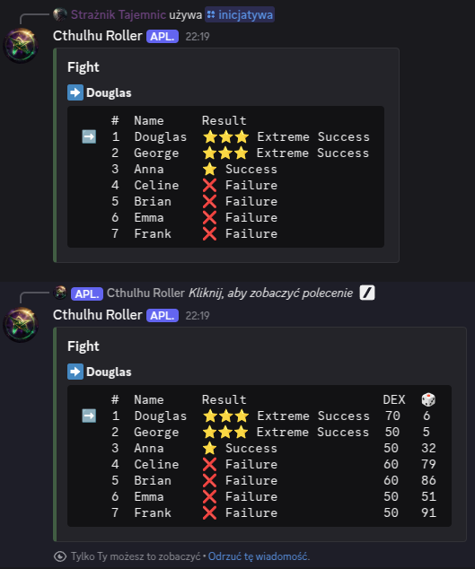
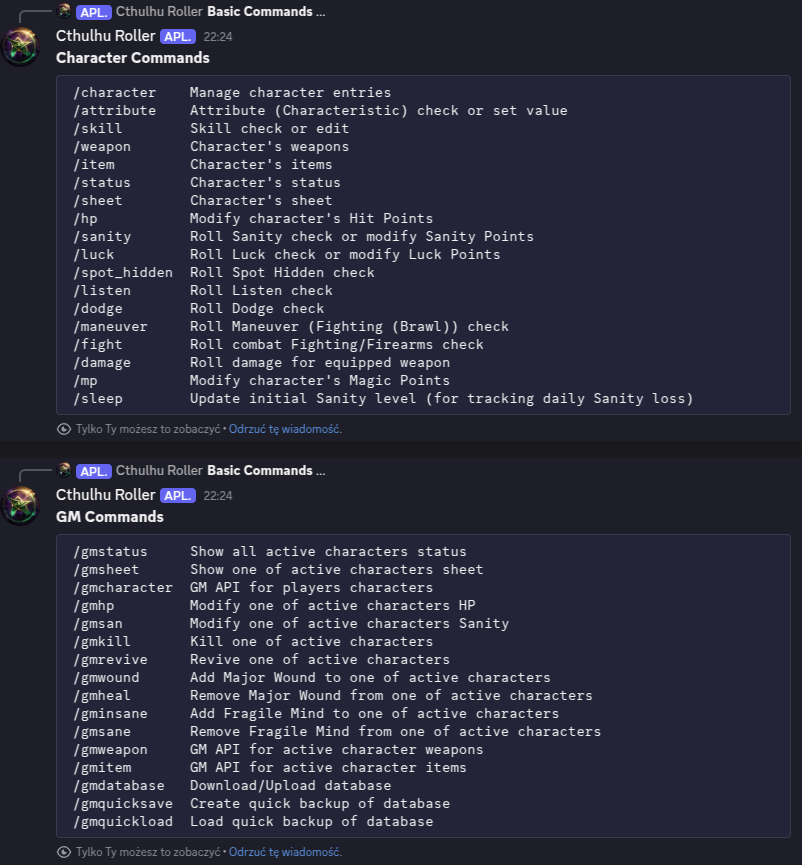

# Cthulhu Roller

**Cthulhu Roller** is a Call of Cthulhu RPG 7E dice roller bot for Discord.

## Installation

[Discord OAuth2](https://discord.com/developers/docs/topics/oauth2)

and

```bash
cp .env.example .env && vim .env
```

For minimal feature list use `--no-default-features`.

For easy service installation use

```bash
scripts/install-service.sh [--no-default-features]
```

## Usage

In grim depths of cold waters always seek

```text
/help
```


### CRoll

Skill test with optional bonus and penalty dice.

Bonus (`+`) and penalty (`-`) dice are being resolved automatically for easier adding circumstances of the roll, for example: test you firearms skill test of threshold `70`, you've been aiming entire previous round (bonus), target is really big (bonus) but moving fast (penalty) so you can roll `70++-`.

Syntax: `<threshold><optional modifier dice symbols>`

Examples: `30+` `20--` `50` `50+` `50-` `70++` `20++---`

```text
/croll 50
```


### Roll

Generic dice roller with multiplier and modifier (modifier is not multiplied).

Syntax: `<optional number of dice>` `d/k` `<sides>` `<optional multiplier>` `<optional modifier>`

Examples: `2d4` `3k6` `24k6+10` `12d8x3` `4k12*2` `6d6x6+6` `d4-2` `k8+k4` `1k6+1k4+1`

```text
/roll 2k6+4
```


### Improve

Improve skill test.

Syntax: `<threshold>`

Examples: `40` `60`

```text
/improve 40
```


### Initiative

Initiative test roller with optional bonus and penalty dice.

Initiative order is defined by: dexterity test success level, dexterity value and lowest roll value.

Bonus and penalty dice are being resolved automatically for easier adding circumstances of the roll, for example: you gain bonus die for initiative roll for being prepared (armed) at the beginning of fight. (see `/croll` command)

Syntax: `<character_name>` `<dexterity>` `<character_name>` `<dexterity>` (and so on)

Example: `/initiative Anna 50+ Brian 60- Celine 60 Douglas 70 Emma 50 Frank 50 George 50`



### Levels

Success levels of threshold.

Syntax: `<threshold>`

Examples: `40` `60`

```text
/levels 60
```


### Extra features

This bot also implements (enabled by default) character sheets creation with mechanics related to skills, stats, weapons, items etc.



Some of commands requires the Keeper user to have a special Discord role (`GM` by default, editable in `db.json`).

Just play around a little. :)


