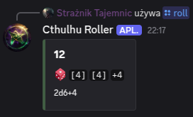
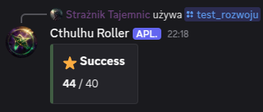
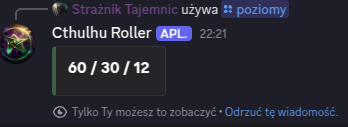
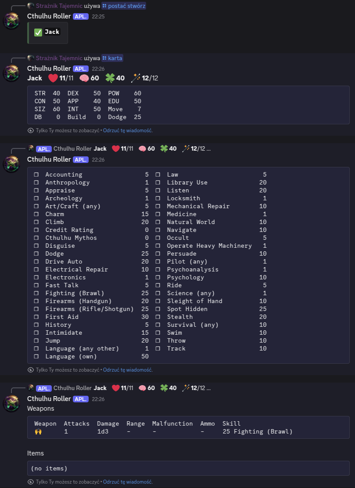

# Cthulhu Roller

**Cthulhu Roller** is a Call of Cthulhu RPG 7E dice roller bot for Discord.

## Installation

[Discord OAuth2](https://discord.com/developers/docs/topics/oauth2)

[Shuttle Quick Start](https://docs.shuttle.rs/getting-started/quick-start)

## Usage

In grim depths of cold waters always seek

```text
/help
```


### CRoll

Call of Cthulhu 7E skill test roller with Bonus ('b' or '+') and penalty ('p', 'k' or '-') dice are being resolved automatically for easier adding circumstances of the roll, for example: test you firearms skill test of threshold 70, you've been aiming entire previous round (bonus), target is really big (bonus) but moving fast (penalty) so you can roll 70bbp.

Syntax: `<threshold>` `<bonus die>/<penalty die>...`

Examples:

`30+`, `20--`, `50`, `50p`, `50k`, `70bb`, `20bbppp`, `40bk`

```text
/croll 50
```


### Roll

Generic dice roller with multiplier and modifier (modifier is not multiplied).

Syntax: `<optional number of dice>` `d/k` `<sides>` `<optional multiplier>` `<optional modifier>`

Examples:

`2d4`, `3k6`, `24k6+10`, `12d8x3`, `4k12*2`, `6d6x6+6`

```text
/roll 2k6+4
```



### Improve

Call of Cthulhu 7E improve skill test.

Syntax: `<threshold>`

```text
/improve 40
```



### Initiative

Call of Cthulhu 7E initiative test roller with optional bonus and penalty dice.

Initiative order is defined by dexterity test success level, dexterity value and lowest roll value.

Bonus and penalty dice are being resolved automatically for easier adding circumstances of the roll, for example: you gain bonus die for initiative roll for being prepared (armed) at the beginning of fight. (see `/croll` command)

Syntax: `<character_name> <dexterity> <character_name> <dexterity> ...`

```text
/initiative Anna 50 Brian 60 Celine 60 Douglas 70 Emma 50 Frank 50 George 50
```


### Levels

Call of Cthulhu 7E success levels of threshold.

Syntax: `<threshold>`

```text
/levels 60
```



### Character sheets

This bot also implements character sheets creation with simple mechanics related to basic stats like HP, Sanity and Luck.

Some of commands requires the Keeper user to have a `GM` role (name hardcoded for now).

Just play around a little.


